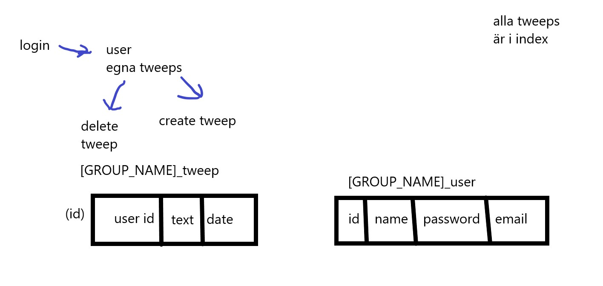

# ALC-login
## Alea Lacta Est
* Levi (Mephit)
* Fabian
* Alvin
* Linus

## 11/03 - 2024
Baskod med bootstrap.
npm run dev visar up index.njk.
Kod för att prata med databasen finns men används inte (det finns ingen databas).

## 12/03 - 2024
Planering enligt instruktioner.
Resultat:

--- 

Arbets del 1.

### Alvin

Skapat tabel i databasen.
Skapat .njk filer.
Skapat några routes i index.js

---

Arbete del 2

### mephit

Mer routes.
Börjat med login formuläret.

---

Arbete del 3

### Fabian

gjort så att login form funkar
lagt till navbar från Bootstrap

---

Arbets del 4

### Alvin

Fixat så att session fungerar.
Börgat med bcrypt.

---

Arbete del 5

### mephit

bcrypt test.
Början på login route.

---

Arbete del 5

### Fabian

funktionel sql fråga så vi får användaren
börjat på att kolla lösenord

---

## 18/03 - 2024

### mephit

Express vadlidation av login.
Fixed some typos.
Express validator ville inte kolla på informationen från body så nu kan den endast göra det.

## 19/03 -2024

### mephit

lite planering

### Linus

Post tweep

# 26/03 - 2024

### Linus

create account